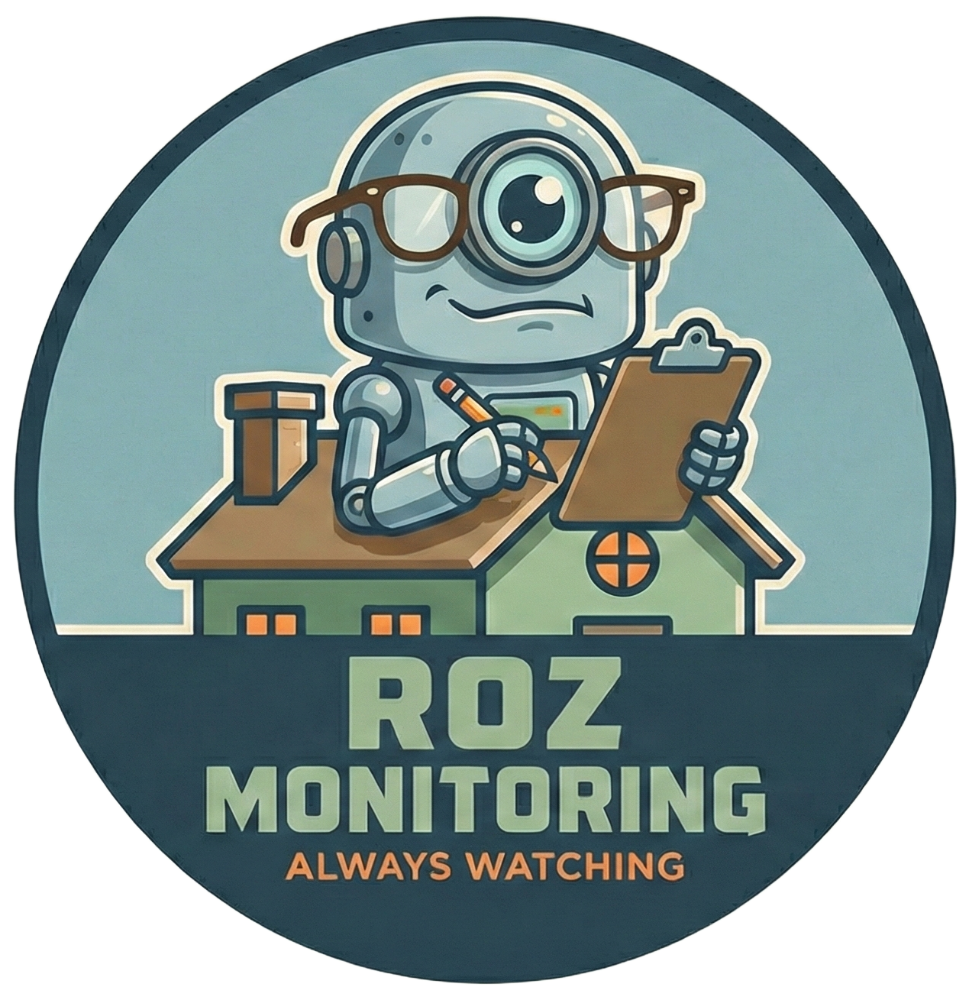

# Roz

<p align="center">
  
</p>

<p align="center">
  <em>"I'm watching you, Wazowski. Always watching."</em>
</p>


The most intelligent home security camera you've ever seen. Roz monitors a webcam, detects motion, analyzes the scene using an LLM with vision capabilities, and then audibly announces changes by comparing what it sees now vs. what it saw previously.

## Features

- **Two-stage Motion Detection**: OpenCV-based frame differencing with configurable sensitivity to limit LLM use.
- **LLM Vision Analysis**: Sends images to a vision-capable LLM to understand what's happening
- **Multi-Frame Context**: Analyzes multiple frames at once to only announce notable differences.
- **Text-to-Speech**: Based on what it sees, it uses text-to-speech to read out what it sees.

## Demo

Here's Roz set up to monitor my front door. Unmute audio for full effect.

https://github.com/user-attachments/assets/31f72b03-0e6d-4fda-944f-4d52ebe990bd


## Requirements

- A Linux system to run the software (I used a Raspberry Pi 4)
- An OpenAI API compatible LLM endpoint with vision support. This can be on the same computer but doesn't have to be. You likely want this hosted locally because it will be sending a *lot* of traffic and you don't want to pay $5/hour for an API. You have been  warned 😈.
- USB webcam. I used [this](https://www.aliexpress.us/item/3256808555869000.html) but any should do. 
- USB speaker/speakerphone for TTS output (configured as ALSA device). I used a [Jabra 410](https://www.amazon.com/Jabra-PHS001U-Speakerphone-Retail-Packaging/dp/B007SHJIO2).
- Python 3.13+ via UV

- Piper TTS voice model (downloaded separately)

## FAQ

**Why did you make this?**

I heard an ad for a service that claimed to analyze images from your video doorbell and describe what it sees. I thought, "That sounds cool, but I'm not paying $20/month for it. Can I make that?"

**Why is it a golden head?**

The first version was just a camera and a speaker in a cardboard box. I 3D printed a case to hold them securely and thought gold paint might look fun. Also, if it was painted gold, maybe people would think of the gold statue from Indiana Jones and not steal it. 

**What LLMs work?**

Any LLM with vision capabilities that provides an OpenAI-compatible API endpoint. I used Qwen3.5 35B-A3B Q4 hosted on another PC in my house with an Nvidia 3090 GPU. You could use [llama.cpp](https://github.com/ggml-org/llama.cpp), vLLM, LM Studio, or similar.

**Can I use a different camera?**

Yes. Any USB webcam that is supported by OpenCV on Linux should work.

**Why do you go through the trouble of detecting motion in the frame? Why not keep it simple and just send every image to the LLM?**

The first stage motion detection is computationally light and works on the Raspberry Pi which only uses a couple watts of power. The second stage runs on a full PC with a GPU and uses about 500 watts. Also, if you only send the frames that have changes in them, you get a quicker response overall because the GPU isn't constantly busy.

**Why does it seem like it is two seconds behind what is happening in the scene?**

This application is the equivalent of:
1. Have a camera capture an image every second
2. Take each image, combine it with a text prompt, and upload it to Claude or ChatGPT.
3. Wait for the text, bring it back to your PC, and then run another program to convert the text response to audio.
4. Start immediately playing the audio while capturing the next frame.
5. Repeat as fast as possible.

On my local setup, the LLM response takes about one second and everything else (request, response, TTS synthesis) takes another second. If you used a GPU for TTS and ran it all on one PC, it would probably be faster.

**Why does Roz occasionally repeat itself?**

Because what constitutes a "meaningful change" in a scene is subjective. In `/src/llm/prompt_config.py`, the prompt is constructed with rules to control when Roz speaks. This is an attempt to balance two extremes: announcing the full contents of every image every second, or only announcing major changes and potentially missing something important. The current configuration worked reasonably well for my setup, but you might want to adjust it for other situations. This is also model-dependent; smaller 4B models respond quickly but aren't as good at following the prompt or discerning meaningful differences. Larger models generally work better, but the four-second response delay can be annoying. Feel free to tweak the prompt to better define what is and isn't important for your environment.  

## Installation

1. **Clone the repository**:
   ```bash
   git clone https://github.com/calz1/roz.git
   cd roz
   ```

2. **Install dependencies** (using uv):
   ```bash
   uv sync
   ```

3. **Download a Piper TTS voice model**:
   ```bash
   # Example: British English voice
   wget https://huggingface.co/rhasspy/piper-voices/resolve/main/en/en_GB/alba/medium/en_GB-alba-medium.onnx
   wget https://huggingface.co/rhasspy/piper-voices/resolve/main/en/en_GB/alba/medium/en_GB-alba-medium.onnx.json
   ```

   Browse available voices at: https://huggingface.co/rhasspy/piper-voices

4. **Configure environment**:
    ```bash
    cp config.yaml.example config.yaml
    ```

    Edit `config.yaml` with your LLM endpoint, voice model, and other settings:
    ```yaml
    llm:
      endpoint: http://your-llm-server:8080/v1/chat/completions
      api_key: not-needed-for-local
      model: qwen35
    ```

## Usage

Run the main application:
```bash
uv run main.py
```

The system will:
1. Initialize the camera and establish a baseline frame
2. Continuously monitor for motion
3. When motion is detected, send frames to the LLM for analysis
4. If a meaningful change is detected, announce it via TTS.

Press `Ctrl+C` to stop.


### config.yaml (Settings)

| Section | Key | Description |
|---------|-----|-------------|
| `llm` | `endpoint` | URL to your LLM API | `http://localhost:8080/v1/chat/completions` |
| `llm` | `api_key` | API key (use "not-needed-for-local" for local LLMs) | `your-api-key` |
| `llm` | `model` | Model name | `qwen3-vl` |
| `llm` | `timeout` | Request timeout in seconds | `30` |
| `llm` | `max_retries` | Maximum retry attempts | `3` |
| `motion` | `sensitivity` | Motion detection sensitivity: `high`, `medium`, `low` | `medium` |
| `motion` | `frame_check_interval_ms` | Milliseconds between frame checks | `100` |
| `motion` | `min_contour_area` | Minimum pixel area to trigger motion | `300` |
| `motion` | `blur_kernel_size` | Gaussian blur kernel size | `7` |
| `motion` | `threshold_delta` | Pixel difference threshold | `25` |
| `motion` | `enable_morphology` | Enable morphological filtering | `false` |
| `motion` | `morphology_kernel_size` | Morphological kernel size | `5` |
| `motion` | `min_motion_pixels` | Minimum total motion pixels | `300` |
| `tts` | `voice_model` | Piper TTS voice model path | `en_US-amy-medium.onnx` |
| `tts` | `volume` | Volume level (0.0 to 1.0) | `1.0` |
| `logging` | `log_dir` | Directory for log files | `logs` |

See `config.yaml.example` for all available options.

## Architecture

```
roz/
├── main.py                 # Main entry point - motion detection loop
├── src/
│   ├── config.py           # Configuration loading (config.yaml only)
│   ├── hardware/
│   │   └── camera.py       # USB camera interface (OpenCV)
│   ├── detection/
│   │   └── motion_detector.py  # Frame differencing motion detection
│   ├── llm/
│   │   ├── vision_analyzer.py  # LLM API client for vision analysis
│   │   └── prompt_config.py    # Prompt templates for change detection
│   └── speech/
│       └── announcer.py    # Piper TTS integration
├── config.yaml.example     # Example application settings
└── pyproject.toml          # Project dependencies
```

## Audio Device Configuration

The TTS output uses ALSA. To find your audio device:

```bash
aplay -l
```

Update the device in `src/speech/announcer.py` if needed (default: `plughw:3,0`).

## Troubleshooting

### Camera Focus & Positioning
If you are running Roz headless (without a monitor) and need to focus or position the camera, use `stream_camera.py`. This script starts a lightweight web server that streams the camera feed to your browser.

```bash
uv run stream_camera.py
```
Then, open your browser and navigate to `http://<your-device-ip>:8080`.

### Audio Issues
If you aren't hearing anything or want to verify your TTS setup, use `test_audio.py`. This script will attempt to initialize the Piper TTS engine and play a test message ("Testing audio output. Hello world.").

```bash
uv run test_audio.py
```
If this fails, check your `config.yaml` to ensure the `tts.device` and `tts.voice_model` paths are correct.

## License

This project is licensed under the GNU Affero General Public License v3.0 (AGPL-3.0). See [LICENSE](LICENSE) for details.

